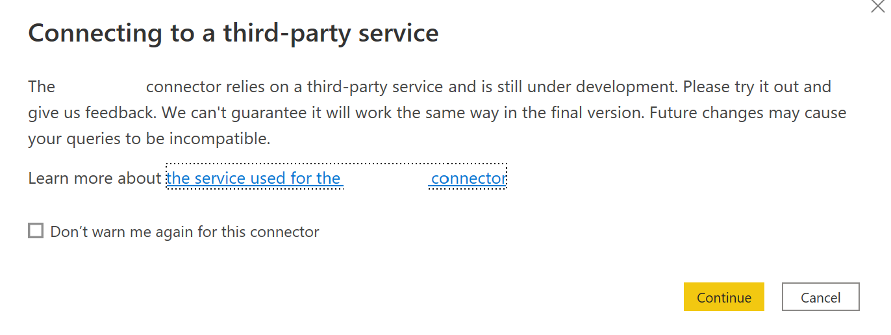
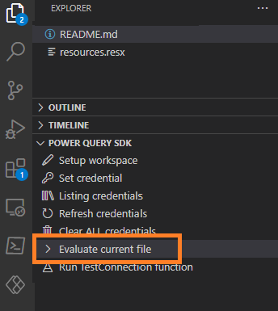

# Power Query Custom Data Connector for Microsoft Planner

This Custom Data Connector wraps many of the "Get" endpoints in the Graph API to get the necessary information for Microsoft Planner. This connector serves as a way to have a library of Power Query functions to build datasets based on the Power BI APIs without the need for storing client secrets or passwords in the dataset.  

Each function returns a JSON body and not a table of data.  This decision was made to provide flexibility in converting the JSON body to tabular data when 1) the API responses are changed by Microsoft or 2) the API responses differ between commercial and sovereign clouds (e.g., GCC, DoD, etc.). 

If you like this work and want to support my costs for licensing and testing, you can contribute to my page on 

There's no pressure, and this code is still under MIT license and free to use whether you contribute or not.  

## Table of Contents

1. [Installation](#installation)
    1. [Desktop](#desktop)
    1. [Using Functions](#using-functions)
    1. [Functions Implemented](#functions-implemented)
    1. [On-Premises Gateway](#on-premises-gateway)
1. [Building Connector](#building-connector)
    1. [Testing Connector](#testing-connector)

## Installation

### Azure
Due to the manner in which authentication works for the Microsoft Graph API, an app must be registred with delegated permissions (listed below).  This app is then used to make requests to Microsoft Planner's API endpoints on behalf of the signed in user.

The following describes the steps needed to setup the app service principal and compile the custom connector to work in your tenant.

1. Follow the instructions to [register an app in the Azure Portal](https://learn.microsoft.com/en-us/azure/active-directory/develop/quickstart-register-app).  

2. During that process the redirect URL should be: "https://oauth.powerbi.com/views/oauthredirect.html"

3. Please also add the following Graph API Delegated Permissions

    * Group.Read.All - This allows the user to pull their groups and find Planner plans associated with their groups.
    * Tasks.Read - For reading Planner plans, buckets, and tasks.
    * Tasks.Read.Shared - For reading Planner tasks.
    * User.ReadBasic.All - This allows users to pull the basic profile information for tasks assigned to a person.

If done correctly, the API Permissions should look like Figure 1.

4. Copy the Application ID.

### Build the Connector

Once the app registration is complete, now you need to compile the connector to user the app service principal.

1. Install Visual Studio code: https://code.visualstudio.com/download.

1. Install Power Query SDK for Visual Studio Code: https://github.com/microsoft/vscode-powerquery-sdk

1. Clone this repo to your local machine.

1. Create a client_id.user file in the project folder.

1. <strong>Copy the Application ID into the client_id.user file located in the project.</strong>

1. Using your keyboard, use the shortcut Ctrl+Shift+B.  Visual Studio will prompt you within the command palette to choose a build task. Select the "build: Build connector project using MakePQX".

2. If the build succeeds the .mez file will update in the folder "bin\AnyCPU\Debug".

3. If the build fails the Power Query SDK often presents a notification (see example below).

4. Close all Power BI Desktop instances on your local machine.  You are often prompted to do so by Power BI Desktop.

5. Copy the .mez file located in the folder "bin\AnyCPU\Debug" to your folder "Documents\Power BI Desktop\Custom Connectors".  If the folder does not exist, create it first.

### Desktop
1. Open Power BI Desktop and navigate to File -> Options and Settings -> Options.

2. Navigate to GLOBAL -> Security and under "Data Extensions" choose "Allow any extension..."

Because this is a custom data connector you have to choose this option in order to use it in Power BI Desktop.

3. Close all Power BI Desktop instances on your local machine.  You are often prompted to do so by Power BI Desktop.

4. Open Power BI Desktop.

5. Select Get Data option.

6. Navigate to the "Other" section and you should see the "Connect to Microsoft Planner API" connector.

7. Select the connector and press the "Connect" button.

8. You may be prompted with the pop-up below. Choose "Continue".

9. If this is your first time using the custom data connector you will be prompted to sign into Office 365. Please follow the instructions to sign in and then choose the "Connect" button.

10. The Navigator prompt will appear (example below).

11. Choose the "ListUsersDirectMemberships" option and you should see a json response (see example below).

12. Then choose the "Transform Data" button.  This should open the Power Query Editor.

13. Under "Applied Steps", remove the steps "Invoked FunctionGetApps1" and "Navigation".

14. You now will see a catalog of the Planner REST APIs to leverage.  I suggest you rename the Query "ListUsersDirectMemberships" to "Function Catalog".

15. I suggest you also uncheck "Enable Load" for the Function Catalog so it doesn't appear in the data model. When disabled the Function Catalog will appear italicized.

### Using Functions

With the Function Catalog created, please follow these steps to leverage the functions:

1. Identify the name of the function you wish to use. Right-click on the "Function" value located for the appropriate row and select "Add as New Query".

2. The function will be created and it can now be used to query the Power BI service.

### Functions Implemented

Not all functions from the Microsoft Planner APIs have been implemented.  Here are the endpoints available at the moment.

### User and Groups
These endpoints are necessary to retrieve plans associated with a group and to get basci profile information (e.g., name, email) for people assigned to a task.
| End Point                      | Description  | MSDN Documentation |
|:-----------------------------|:-------------|:------------------|
| GetUser                        | Retrieve the properties and relationships of user object.  | [Get a user](https://learn.microsoft.com/en-us/graph/api/user-get?view=graph-rest-1.0&tabs=http) |
| ListUsersDirectMemberships                       | Get groups, directory roles, and administrative units that the user is a direct member of. This operation is not transitive.  | [List a user's direct memberships](https://learn.microsoft.com/en-us/graph/api/user-list-memberof?view=graph-rest-1.0&tabs=http) |

### Plans
| End Point                      | Description  | MSDN Documentation |
|:-----------------------------|:-------------|:------------------|
| ListPlans             | Retrieve a list of plannerPlan objects owned by a group object.  | [List plans](https://learn.microsoft.com/en-us/graph/api/plannergroup-list-plans?view=graph-rest-1.0&tabs=http) |
| GetPlan             | Retrieve the properties and relationships of a plannerplan object.  | [Get Planner Plan](https://learn.microsoft.com/en-us/graph/api/plannerplan-get?view=graph-rest-1.0&tabs=http) |
| ListPlanTasks             | Retrieve a list of plannerTask objects associated with a plannerPlan object.  | [List Plan Tasks](https://learn.microsoft.com/en-us/graph/api/plannerplan-list-tasks?view=graph-rest-1.0&tabs=http) |
| ListBuckets             | Retrieve a list of plannerBucket objects contained by a plannerPlan object.  | [List Buckets](https://learn.microsoft.com/en-us/graph/api/plannerplan-list-buckets?view=graph-rest-1.0&tabs=http) |
| GetTask            | Retrieve the properties and relationships of plannerTask object.  | [Get Planner Task](https://learn.microsoft.com/en-us/graph/api/plannertask-get?view=graph-rest-1.0&tabs=http) |
| GetTasksDetails           | Retrieve the properties and relationships of a plannerTaskDetails object.  | [Get Planner Task Details](https://learn.microsoft.com/en-us/graph/api/plannertaskdetails-get?view=graph-rest-1.0&tabs=http) |
| GetPlanDetails          | Retrieve the properties and relationships of a plannerPlanDetails object.  | [Get Planner Plan Details](https://learn.microsoft.com/en-us/graph/api/plannerplandetails-get?view=graph-rest-1.0&tabs=http) |
| GetBucket          | Retrieve the properties and relationships of a plannerBucket object.  | [Get Planner Bucket](https://learn.microsoft.com/en-us/graph/api/plannerbucket-get?view=graph-rest-1.0&tabs=http) |
| ListBucketTasks          | Retrieve a list of plannerTask objects associated to a plannerBucket object.  | [List Bucket Tasks](https://learn.microsoft.com/en-us/graph/api/plannerbucket-list-tasks?view=graph-rest-1.0&tabs=http) |
| GetAssignedToTaskBoardFormat           | Retrieve the properties and relationships of a plannerAssignedToTaskBoardTaskFormat object.  | [Get Planner Assigned To Task Board Task Format](https://learn.microsoft.com/en-us/graph/api/plannerassignedtotaskboardtaskformat-get?view=graph-rest-1.0&tabs=http) |
| GetBucketTaskBoardFormat         | Retrieve the properties and relationships of plannerBucketTaskBoardTaskFormat object.  | [Get Planner Bucket Task Board Task Format](https://learn.microsoft.com/en-us/graph/api/plannerbuckettaskboardtaskformat-get?view=graph-rest-1.0&tabs=http) |
| GetProgressTaskBoardFormat | Retrieve the properties and relationships of plannerProgressTaskBoardTaskFormat object.  | [Get Planner Progress Task Board Task Format](https://learn.microsoft.com/en-us/graph/api/plannerprogresstaskboardtaskformat-get?view=graph-rest-1.0&tabs=http) |

### On-Premises Gateway

The custom data connector will need to be installed in the a Power BI Gateway in order to refresh datasets leveraging this custom connector.  For more information on installing a custom data connector with a gateway please see: https://learn.microsoft.com/en-us/power-bi/connect-data/service-gateway-custom-connectors.

## Building Connector

### Prerequisites 

1. Install Visual Studio code: https://code.visualstudio.com/download.
1. Install Power Query SDK for Visual Studio Code: https://github.com/microsoft/vscode-powerquery-sdk
1. Clone this repo to your local machine.

## Compile

In order to the compile the custom data connector to the .mez file, please follow these instructions:

1. Using your keyboard, use the shortcut Ctrl+Shift+B.  Visual Studio will prompt you within the command palette to choose a build task. Select the "build: Build connector project using MakePQX".

2. If the build succeeds the .mez file will update in the folder "bin\AnyCPU\Debug".

3. If the build fails the Power Query SDK often presents a notification (see example below).

### Testing Connector

In order to test the custom data connector, please follow these instructions:

1. Choose the "Set Credential" option within the Power Query SDK. Select AAD and follow the prompts to log into Microsoft 365.

2. The .query.pq file is used to test the custom data connector, please update the section labeled "TEST VARIABLES" for your own environment.

3. When you are ready to test, use the "Evaluate current file" option in the Power Query SDK in the "Explorer" tab.

4. When the testing completes, a new tab will be present any failed results or if all the tests passed (example below).

